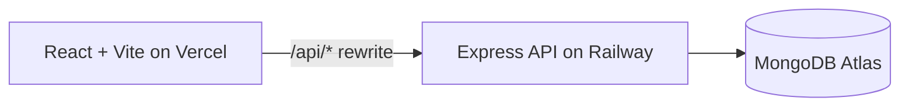

# Tech Stack & Architecture

## Versions
- Frontend
  - React: 19.1.x
  - Vite: 7.3.x
  - Axios: 1.13.x
- Backend
  - Node: 20.x (engines pinned)
  - Express: 4.22.x
  - MongoDB Driver: 6.18.x
- Tooling
  - Mocha + Supertest (backend tests)
  - ESLint (frontend)
  - Concurrently (root dev orchestration)

## Architecture

## Responsibilities
- Frontend
  - UI and state: React
  - Build and dev server: Vite
  - API calls: Axios
  - API base: relative `/api/todos` for dev + prod routing
- Backend
  - REST endpoints: `/api/todos` (GET, POST, PUT, DELETE)
  - Health checks: `/api/health`, `/health`
  - DB access: `mongodb` driver

## Security
- Helmet for secure headers
- Rate limiting (100 requests / 15 minutes)
- CORS restricted to `FRONTEND_URL`
- No secrets in repo: use `backend/.env` (see `.env.example`)
- Dependency audit fixed

## Deployment
- Frontend: Vercel
  - `frontend/vercel.json` rewrites `/api/(.*)` → Railway backend
- Backend: Railway
  - Build root set to `backend` via `railway.toml`
  - Env vars required: `MONGODB_URI`, `FRONTEND_URL`

## Local DX
- Root scripts
  - `npm run install:all` → install both apps
  - `npm run dev` → run backend and frontend together
  - `npm run build` → build frontend
  - `npm run lint` → lint frontend
- Backend tests
  - `cd backend && npm test`

## One‑Day Demo
1. Deploy backend to Railway and set env vars.
2. Deploy frontend to Vercel and confirm rewrite points to backend.
3. Share the Vercel URL for demo.
4. After one day, pause/delete Vercel project and Railway service.

See also: [README](./README.md)
